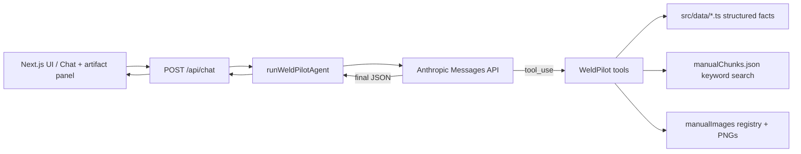

# WeldPilot: Multimodal Agent for the Vulcan OmniPro 220

This repo is my submission for the Prox challenge: a **manual-grounded product support copilot** for the Harbor Freight **Vulcan OmniPro 220** multiprocess welder. The emphasis is on **reliable grounding**—Anthropic tool orchestration (Messages API + typed tools), **structured JSON “artifact” blocks**, and **local hybrid knowledge** (deterministic facts + PDF text chunks + rasterized manual pages)—so the demo behaves like field-grade support, not a thin PDF chatbot.

**Original challenge brief:** see [CHALLENGE.md](./CHALLENGE.md).

## Live demo

**Deployed on Vercel:** [https://prox-challenge-chi.vercel.app/](https://prox-challenge-chi.vercel.app/)

## Demo video / GIF

_Add your Loom or YouTube walkthrough here after recording._

Example:

- **Video:** `https://www.loom.com/share/...` or `https://www.youtube.com/watch?v=...`

## Features

- **Voice mode (browser)** — **Hands-free**: leave the mic on and say **“Hey Weld”** to wake; the app plays **“How can I help you?”** and listens for your question, then returns to standby until you say **Hey Weld** again. **Speak once**: one-shot dictation. **Read replies** toggles text-to-speech for answers. Uses the Web Speech API (best in Chrome/Edge on HTTPS or `localhost`).
- **Manual-grounded chat** with clarifying questions when process, voltage, or wire type matters
- **Polarity diagrams** (SVG-style React layout: +/- sockets, cable roles, disconnected paths)
- **Duty cycle results** with 10-minute weld/rest bar when an exact manual anchor exists; honest “nearest rating” messaging when it does not
- **Process selector** (selection-chart-informed heuristics + tradeoffs)
- **Troubleshooting flowcharts** (expandable steps, safety preamble, manual page refs)
- **Setup checklists** with local step completion state
- **Manual image references** (pre-rendered pages under `public/manual-pages/`)

## Architecture



### Knowledge extraction (hybrid)

1. **Structured TypeScript** for high-risk facts: duty cycles, polarity routes, setup flows, troubleshooting trees, process capabilities (`src/data/`).
2. **Deterministic tool functions** so the model cannot “guess” anchor duty cycles or swap polarity silently.
3. **PDF text chunks** (`src/data/manualChunks.json`) from `files/*.pdf` via `npm run extract-manual` — used for `searchManual` (keyword scoring, no embedding dependency).
4. **Image registry** (`src/data/manualImages.ts`) + **rasterized pages** (`npm run rasterize-manual` → `public/manual-pages/*.png`).

### Claude Agent SDK

- **`@anthropic-ai/claude-agent-sdk`** is installed for challenge alignment. **`npm run agent-smoke`** runs a minimal read-only `query()` against `src/data/dutyCycles.ts` to verify the SDK in your environment.
- **The web app** uses **`@anthropic-ai/sdk`** (Messages API) with the same **tool-calling agent loop** pattern Anthropic documents for custom agents: lower latency, no Claude Code subprocess per chat turn, and a predictable JSON contract for the UI.

### Design decisions

- **Deterministic lookup** for duty cycle and polarity: these are safety- and warranty-adjacent; they must match the manual anchors exactly.
- **Visual blocks** instead of text-only: garage users reason spatially about cable routing; diagrams and manual crops reduce miswiring risk.
- **Structured troubleshooting**: enforces ordering (“check first”), safety preambles, and consistent manual citations.
- **Ambiguity**: the model is prompted to set `needsClarification` / `clarifyingQuestion` when gas vs self-shielded flux, voltage, or thickness is missing.

## Run locally

```bash
git clone <your-fork>
cd prox-challenge
cp .env.example .env
# Add ANTHROPIC_API_KEY to .env
npm install
npm run dev
```

Open [http://localhost:3000](http://localhost:3000).

### Regenerate knowledge artifacts (optional)

```bash
npm run extract-manual      # refresh manualChunks.json from files/*.pdf
npm run rasterize-manual    # refresh public/manual-pages/*.png (requires PDFs in files/)
```

### Tests

```bash
npm test
```

## Environment variables

| Variable | Required | Description |
|----------|----------|-------------|
| `ANTHROPIC_API_KEY` | Yes | From [Anthropic Console](https://console.anthropic.com/) |
| `ANTHROPIC_MODEL` | No | Defaults to `claude-sonnet-4-6`; use an ID returned by `GET /v1/models` for your key |

## Evaluation-ready demo questions

Use these in a walkthrough; the UI includes matching quick chips.

1. **MIG 200A @ 240V duty cycle** → **25%** duty cycle; **2.5 min** weld / **7.5 min** rest per 10 minutes; duty cycle card + manual source note.
2. **Flux-cored polarity** → Ground **positive**, wire feed power **negative**; polarity diagram + DCEP vs DCEN note for solid MIG vs self-shielded flux.
3. **TIG polarity / ground clamp socket** → Ground **positive**, torch **negative**, gas to regulator, optional foot pedal, wire feed disconnected; diagram.
4. **Porosity in flux-cored** → Clarify gas-shielded vs self-shielded; troubleshooting flow prioritizes cleanliness, polarity, wire, arc, wind—not “check gas” first for self-shielded.
5. **Wire feed motor runs, wire does not feed** → Troubleshooting flow + **interior controls** manual image (post-process hook).
6. **1/8" mild steel outdoors, no gas** → Flux-Cored or Stick recommendation with tradeoffs.
7. **Front panel controls** → Front panel PNG + label card.
8. **Load wire spool** → Safety warning + setup checklist + quick-start imagery.

## Limitations

- Not a replacement for formal welding safety training, code compliance, or the official manual.
- Duty cycle **between** published anchors is **not** interpolated to a fake exact percentage; the UI explains nearest manual ratings.
- Full multimodal PDF understanding is approximated via rasterized pages + chunk search—not pixel-perfect OCR of every diagram.

## Future scope: affect-aware assistance with Amazon Comprehend

Where I’d like to take this next—beyond the grounded tool loop—is **emotionally intelligent routing** in a narrow, operational sense: noticing when a user sounds frustrated, rushed, or overwhelmed *before* they fully spell out a symptom, and adapting **tone, pacing, and how aggressively we surface safety guardrails**, without weakening deterministic lookups (duty cycle, polarity, etc.).

**Amazon Comprehend** is a sensible hook for that layer: run **sentiment / syntax-style signals on transcript text** (from the existing browser speech pipeline or typed input), attach compact labels to each turn, and apply a small policy before the agent loop—e.g., calmer clarification prompts, shorter spoken replies when stress is high, or extra emphasis when language looks ambiguously “panic-adjacent” around hot equipment.

**Scope honesty:** that pipeline is **not implemented here**; this section is forward-looking. What *is* relevant is feasibility on my side: I already have **hands-on experience with Amazon Comprehend**, and I have **built and developed projects using it** as part of my **graduate research at Arizona State University (ASU)**. Wiring Comprehend-style NLP signals into a grounded industrial assistant is the kind of applied, safety-adjacent HCI problem I’m motivated to keep pursuing.

## Future improvements

- Photo upload + vision pass for cable routing checks
- Expand hosted demo notes (env vars on Vercel, usage limits)
- Tighter manual callouts (cropped hotspots, clickable hotspots)
- Deeper settings configurator wired to more manual tables

## Project layout (high level)

```
src/
  app/                 # Next.js App Router, chat UI, /api/chat
  components/          # Artifact renderers (polarity, duty cycle, etc.)
  data/                # dutyCycles, polarity, troubleshooting, manualChunks.json, …
  lib/agent/           # Tool definitions, executor, Anthropic loop
  lib/knowledge/       # Manual keyword search
  types/               # WeldPilot JSON contract
public/
  manual-pages/        # Rasterized manual PNGs
  files/               # PDFs (copy for static download)
  *.webp               # Product photos
files/                 # Source PDFs (challenge inputs)
scripts/               # PDF chunk + rasterize + Agent SDK smoke test
```

## License / attribution

Product documentation PDFs and imagery are used here for the Prox challenge submission. WeldPilot is an independent demo and is not affiliated with Harbor Freight or Vulcan.
